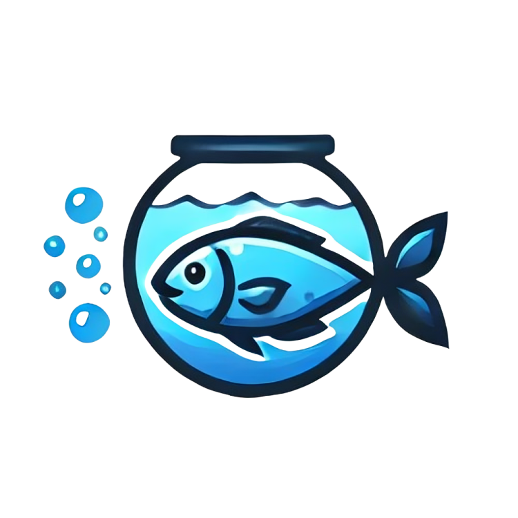

# Aquário

> **👨‍💻 Desenvolvedores**: Para guia técnico completo, veja [README-DEV.md](README-DEV.md)



## Visão Geral

O **Aquário** é um projeto open source focado em centralizar informações relevantes para os alunos do Centro de Informática (CI). A plataforma visa resolver problemas como a falta de informação e o excesso de locais para buscar informações, facilitando o acesso e a comunicação entre alunos, professores e laboratórios.

## Funcionalidades

### 1. Blog/Notícias/Posts

- **Usuários com contas cadastradas** podem compartilhar posts e publicações.
- **Tipos de Publicações**:
  - Informações específicas de centros acadêmicos.
  - Projetos pessoais e de laboratórios.
  - Dicas de alunos veteranos.
  - Dicas de professores.

### 2. Laboratórios e Seus Projetos

- **Banco de Dados de Laboratórios**:
  - Cada laboratório possui uma conta verificada.
  - Publicações de projetos com informações como membros, linguagens de programação, detalhes públicos e casos de uso de soluções.

### 3. Vagas de Estágio/Emprego

- **Publicações de Vagas**:
  - Contas verificadas de laboratório e professores podem publicar vagas, abrangendo estágio, monitoria, projetos voluntários, iniciação científica e etc.
- **Benefícios**:
  - Redução da superlotação de e-mails.
  - Melhor organização das informações de vagas.

### 4. Achados e Perdidos

- **Scraping do E-mail Acadêmico** para adicionar itens automaticamente.
- **Adições Manuais** de itens encontrados ou perdidos (Tadea terá seu perfil oficial)

### 5. FAQ

- **Guias** sobre diversos assuntos para alunos dos períodos inicias.
- **As Dúvidas e Respostas** mais buscadas por alunos acerca dos cursos, centros, processos e diversos outros assuntos.
- **Documentos** mais importantes e utilizados pelos alunos.

## Objetivo

O objetivo do projeto Aquário é centralizar as informações do CI e oferecer uma solução eficiente para problemas de comunicação e disseminação de informações, facilitando o acesso e o compartilhamento de informações importantes entre todos os membros da comunidade acadêmica.

## Modelo de Dados

Abaixo está o diagrama de classes UML que representa a estrutura de dados do projeto.


## Design

O design, ainda em desenvolvimento, está no link do figma: https://www.figma.com/design/9got8rICitaYaapG3n1COx/Aquario?node-id=9-92&t=J3rS2QW7M6zhEWLI-1

## Contribuidores

Agradecemos a todos os contribuidores que ajudaram a tornar este projeto possível!

### Contribuidores com Avatares


### Gráfico de Contribuidores (GitHub Nativo)


### Estatísticas do Repositório


### Linguagens Mais Usadas


## Como Contribuir

O **Aquário** é um projeto open source e as contribuições são muito bem-vindas! Veja como você pode contribuir:

1. **Fork este repositório** e clone o fork para o seu ambiente local.


### Opção 20: Estatísticas Gerais do Usuário Principal


### Opção 21: Streak de Contribuições


---

## 🔧 **Soluções para Estatísticas Detalhadas por Contribuidor**

### GitHub Action para Análise de Contribuidores

````yaml
# .github/workflows/contributor-stats.yml
name: Contributor Statistics
on:
  push:
    branches: [main, master]
  schedule:
    - cron: "0 0 * * 0" # Weekly backup
jobs:
  generate-stats:
    runs-on: ubuntu-latest
    steps:
      - name: Checkout repository
        uses: actions/checkout@v3
        with:
          fetch-depth: 0
          token: ${{ secrets.GITHUB_TOKEN }}

      - name: Generate Contributor Stats
        run: |
          echo "# 📊 Estatísticas de Contribuidores" > CONTRIBUTOR_STATS.md
          echo "" >> CONTRIBUTOR_STATS.md
          echo "## Commits por Contribuidor" >> CONTRIBUTOR_STATS.md
          echo "" >> CONTRIBUTOR_STATS.md
          echo '```' >> CONTRIBUTOR_STATS.md
          git shortlog -s -n >> CONTRIBUTOR_STATS.md
          echo '```' >> CONTRIBUTOR_STATS.md
          echo "" >> CONTRIBUTOR_STATS.md
          echo "## Linhas de Código por Contribuidor" >> CONTRIBUTOR_STATS.md
          echo "" >> CONTRIBUTOR_STATS.md
          echo '```' >> CONTRIBUTOR_STATS.md
          git log --pretty=format:%aE | sort | uniq | while read email; do
            echo "Author: $email"
            git log --author="$email" --pretty=tformat: --numstat | awk '{add+=$1; del+=$2} END {printf "Added: %d, Deleted: %d\n\n", add, del}'
          done >> CONTRIBUTOR_STATS.md
          echo '```' >> CONTRIBUTOR_STATS.md
          echo "" >> CONTRIBUTOR_STATS.md
          echo "*Última atualização: $(date)*" >> CONTRIBUTOR_STATS.md

      - name: Commit and push changes
        run: |
          git config --local user.email "action@github.com"
          git config --local user.name "GitHub Action"
          git add CONTRIBUTOR_STATS.md
          git diff --staged --quiet || git commit -m "📊 Update contributor statistics [skip ci]"
          git push
````

### Script Manual para Estatísticas

```bash
# Contar commits por contribuidor
git shortlog -s -n

# Contar linhas adicionadas/deletadas por contribuidor
git log --pretty=format:%aE | sort | uniq | while read email; do
  echo "Author: $email"
  git log --author="$email" --pretty=tformat: --numstat | awk '{add+=$1; del+=$2} END {printf "Added: %d, Deleted: %d\n\n", add, del}'
done
```

## Como Contribuir

O **Aquário** é um projeto open source e as contribuições são muito bem-vindas! Veja como você pode contribuir:

1. **Fork este repositório** e clone o fork para o seu ambiente local.
2. **Crie uma nova branch** para a sua feature ou correção de bug:
   ```sh
   git checkout -b minha-feature
   ```
3. **Faça as modificações** necessárias no código.
4. **Faça commit das suas alterações** (importante seguir o nosso padrão de commits)
   ```sh
   git commit -m "Minhas alterações"
   ```
5. **Envie as suas alterações** para o seu fork no GitHub:
   ```sh
   git push origin minha-feature
   ```
6. **Abra um Pull Request** neste repositório, descrevendo detalhadamente as suas alterações.

## Licença

Este projeto está licenciado sob a [Licença MIT](LICENSE).

## Contato

Se você tiver alguma dúvida, sugestão ou feedback, sinta-se à vontade para abrir uma [issue](https://github.com/ralfferreira/aquario/issues) ou enviar um e-mail para [ralf.ferreira@academico.ufpb.br](mailto:ralf.ferreira@academico.ufpb.br).

---

Esperamos que você goste de usar o Aquário e que ele facilite a sua vida acadêmica. Contribua e ajude a melhorar esta plataforma!
