## Arquitetura do Backend

O backend do Aquário é construído seguindo os princípios do **Domain-Driven Design (DDD)**, organizado em uma arquitetura de camadas para garantir separação de responsabilidades, testabilidade e escalabilidade. A estrutura é modular, com cada funcionalidade (módulo) contida dentro de sua própria pasta nas camadas correspondentes.

### Arquitetura de Camadas com Módulos

A estrutura é organizada em camadas, e dentro de cada camada, o código é agrupado por **módulo de funcionalidade** (ex: `vagas`, `usuarios`, `publicacoes`). Isso mantém o código relacionado a uma feature coeso e desacoplado de outras partes do sistema.

-   `src/`
    -   `domain/`
        -   `vagas/`
            -   `entities/` (Ex: `Vaga.ts`)
            -   `repositories/` (Ex: `IVagasRepository.ts` - a interface)
    -   `application/`
        -   `vagas/`
            -   `use-cases/` (Ex: `CriarVaga.ts`)
    -   `infrastructure/`
        -   `http/` (API e rotas)
            -   `vagas/` (Ex: `VagasController.ts`, `vagas.routes.ts`)
        -   `database/` (Implementação do repositório)
            -   `prisma/`
                -   `repositories/` (Ex: `PrismaVagasRepository.ts`)

### Princípio: Parse, Don't Validate

Em vez de validar dados de entrada e depois passá-los adiante como tipos primitivos (string, number), nós usamos bibliotecas como o **Zod** para "parsear" (analisar e converter) esses dados em tipos de domínio seguros desde o início. Se o parse falhar, a requisição é rejeitada na camada de entrada (API). Se for bem-sucedido, o resto da aplicação (casos de uso, domínio) pode confiar que os dados estão corretos e bem tipados, eliminando a necessidade de validações repetitivas.

As principais camadas são:

-   **`domain`**: O coração da aplicação. Contém a lógica de negócio principal, entidades, e regras que são independentes de qualquer tecnologia externa.
-   **`application`**: Orquestra as ações do domínio. Contém os casos de uso (use cases) da aplicação, que são acionados pelos controladores.
-   **`infrastructure`**: Contém as implementações técnicas das interfaces definidas no domínio (ex: repositórios de banco de dados, clientes HTTP).
-   **`presentation`**: A camada de entrada da aplicação. Responsável por receber requisições HTTP (usando Express), validar dados (com Zod) e retornar respostas.

## Modelo de Dados (UML)

O diagrama abaixo representa a estrutura do banco de dados e os relacionamentos entre as entidades do sistema.

